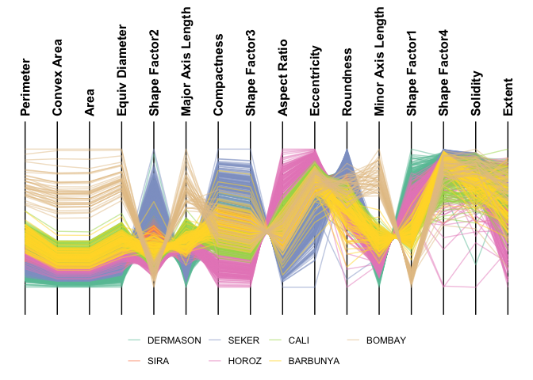
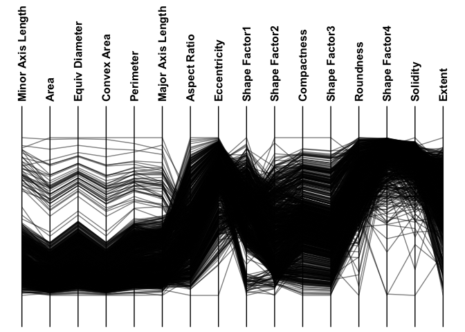

<!-- README.md is generated from README.Rmd. Please edit that file -->

# ggEDA <a href="https://CCICB.github.io/ggEDA/"></a>

<!-- badges: start -->

[](https://CRAN.R-project.org/package=ggEDA)
[](https://github.com/CCICB/ggEDA/actions/workflows/R-CMD-check.yaml)
[](https://lifecycle.r-lib.org/articles/stages.html#experimental)
[](https://app.codecov.io/gh/CCICB/ggEDA?branch=main)
[](https://github.com/CCICB/ggEDA/issues)
[](https://github.com/CCICB/ggEDA)
[](https://github.com/CCICB/ggEDA/commits/main)
[](https://ccicb.r-universe.dev)
<!-- badges: end -->

**ggEDA** streamlines exploratory data analysis by providing turnkey
approaches to visualising n-dimensional data which can graphically
reveal correlative or associative relationships between two or more
features:

- **ggstack**: tiled one-dimensional visualisations that more
  effectively show missingness and complex categorical relationships in
  smaller datasets.
- **ggparallel**: parallel coordinate plots (PCPs) for examining large
  datasets with mostly quantitative features.

## Installation

``` r
install.packages("ggEDA")
```

### Development Version

You can install the development version of ggEDA from
[GitHub](https://github.com/CCICB/ggEDA) with:

``` r
if (!require("remotes"))
    install.packages("remotes")

remotes::install_github("CCICB/ggEDA")
```

Or from R-universe with:

``` r
install.packages("ggEDA", repos = "https://ropensci.r-universe.dev")
```

## Quick Start

For examples of interactive EDA plots see the [ggEDA
gallery](https://CCICB.github.io/ggEDA/articles/gallery.html)

``` r
# Load library
library(ggEDA)

# Plot data, sort by Glasses
ggstack(
  baseballfans,
  col_id = "ID",
  col_sort = "Glasses",
  interactive = FALSE,
  verbose = FALSE,
  options = ggstack_options(legend_nrow = 2)
)
```


## Customise Colours

Customise colours by supplying a named list to the `palettes` argument

``` r
ggstack(
  baseballfans,
  col_id = "ID",
  col_sort = "Glasses",
  palettes = list("EyeColour" = c(
    Brown = "rosybrown4",
    Blue = "steelblue",
    Green = "seagreen"
  )),
  interactive = FALSE,
  verbose = FALSE,
  options = ggstack_options(legend_nrow = 2)
)
```


## Parallel Coordinate Plots

For datasets with many observations and mostly numeric features,
parallel coordinate plots may be more appropriate.

``` r
ggparallel(
 data = minibeans,
 col_colour = "Class",
 order_columns_by = "auto",
 interactive = FALSE
)
#> ℹ Ordering columns based on mutual information with [Class]
```



``` r
 ggparallel(
   data = minibeans,
   col_colour = "Class",
   highlight = "DERMASON",
   order_columns_by = "auto",
   interactive = FALSE
 )
#> ℹ Ordering columns based on how well they differentiate 1 group from the rest [DERMASON] (based on mutual information)
```


``` r
 ggparallel(
   data = minibeans,
   order_columns_by = "auto",
   interactive = FALSE
 )
#> ℹ To add colour to plot set `col_colour` to one of: Class
#> ℹ Ordering columns to minimise crossings
#> ℹ Choosing axis order via repetitive nearest neighbour with two-opt refinement
```



## Community Contributions

All types of contributions are encouraged and valued. See our [guide to
community
contributions](https://CCICB.github.io/ggEDA/CONTRIBUTING.html) for
different ways to help.
